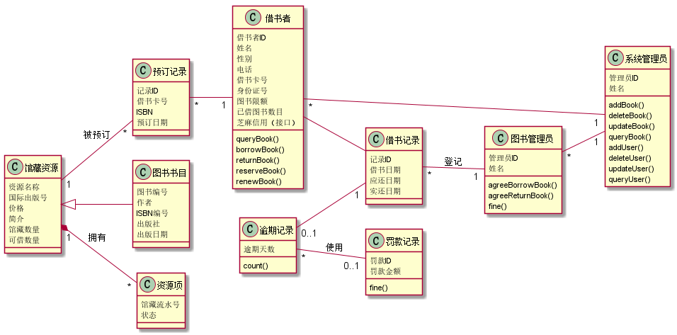
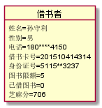
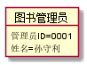
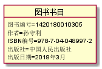
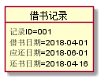
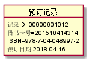

# 实验3 图书管理系统领域对象建模
|    学号    |       班级       |      姓名     |    照片    | 
|:-------:|:------------- | ----------:|----------:|
|   201510414314  |     2015级3班    |   孙守利   |   |

##  一、图书管理系统的类图
###  1 类图PlantUML源码如下：
```
@startuml
left to right direction
Class 借书者{
 借书者ID
 姓名
 性别
 电话
 借书卡号
 身份证号
 图书限额
 已借图书数目
 芝麻信用（接口）
 queryBook()
 borrowBook()
 returnBook()
 reserveBook()
 renewBook()
}
Class 图书管理员{
 管理员ID
 姓名
 agreeBorrowBook()
 agreeReturnBook()
 fine()
}
Class 系统管理员{
 管理员ID
 姓名
 addBook()
 deleteBook()
 updateBook()
 queryBook()
 addUser()
 deleteUser()
 updateUser()
 queryUser()
}
Class 借书记录{
 记录ID
 借书日期
 应还日期
 实还日期
}
Class 逾期记录{
 逾期天数
 count()
}
Class 罚款记录{
 罚款ID
 罚款金额
 fine()
}
Class 预订记录{
 记录ID
 借书卡号
 ISBN
 预订日期
}
Class 图书书目{
 图书编号
 作者
 ISBN编号
 出版社
 出版日期
}
Class 馆藏资源{
资源名称
国际出版号
价格
简介
馆藏数量
可借数量
}
Class 资源项{
馆藏流水号
状态
}
Class 数据存储类{
query()
edit()
}
借书者 -- 借书记录
图书管理员 "1" -up- "*"借书记录 :登记
借书记录"1" -up- "0..1"逾期记录
逾期记录"*" -- "0..1"罚款记录:使用
借书记录 "*" -up- "1"数据存储类
预订记录"*" -- "1"借书者
预订记录 "*" -- "1" 数据存储类
馆藏资源"1" -- "*"预订记录 :被预订
图书书目 -up-|> 馆藏资源
馆藏资源"1" *-- "*"资源项:拥有
数据存储类 -- 系统管理员
@enduml
```
### 2 类图如下:

### 3 类图说明：
##### （1）借书者
    借阅者类属性有很多，包括姓名、性别、电话、借书卡号、身份证号、图书限额、已借的图书数目、信誉额度等。其主要操作有借书、还书、预约图书等。
##### （2）图书管理员
    图书管理员属性有姓名和职工号，其主要操作为对借书、还书进行操作，以及罚款操作。
##### （3）系统管理员
    系统管理员属性有姓名和职工号，其主要操作是对图书、借阅者信息进行增删查改操作。
##### （4）图书书目
    图书数目是记录书目信息的类，包括作者、ISBN编号、出版社、出版日期等。
##### （5）借书记录
    借书记录是某本书的借阅信息类，包括借书日期、应还日期、归还日期。
##### （6）预订记录
    预订记录是借阅者对某本书的预订信息类，包括借书卡号、ISBN、预订日期。
##### （7）数据存储类
    数据存储类是书籍永久的存储类，在数据库中的存储数据，其它对与书籍有关的活动都要经过其存储类。
## 二、图书管理系统的对象图
### 1 借阅者类的对象图
#### 源码如下：
    @startuml
    object 借书者{
        姓名=孙守利
        性别=男
        电话=180****4150
        借书卡号=201510414314
        身份证号=5115**********3237
        图书限额=5
        已借图书=0
        芝麻分=706
    }
    @enduml
#### 对象图如下：

### 2 图书管理员类的对象图
#### 源码如下：
    @startuml
    object 图书管理员{
        管理员ID=0001
        姓名=孙守利
    }
    @enduml
#### 对象图如下：

### 3 系统管理员类的对象图
#### 源码如下：
    @startuml
    object 系统管理员{
        管理员ID：A00001
        姓名:李放
    }
    @enduml
#### 对象图如下：

### 4 图书书目类的对象图
#### 源码如下：
    @startuml
    object 图书书目{
        图书编号=1420180010305
        作者=孙守利
        ISBN编号=978-7-04-048997-2
        出版社=中国人民出版社
        出版日期=2018年3月
    }
    @enduml
#### 对象图如下：

### 5 借书记录类的对象图
#### 源码如下：
    @startuml
    object 借书记录{
        记录ID=001
        借书日期=2018-04-01
        应还日期=2018-06-01
        还书日期=2018-04-16
    }
    @enduml
#### 对象图如下：

### 6 预订记录类的对象图
#### 源码如下：
    @startuml
    object 预订记录{
        记录ID=00000001012
        借书卡号=201510414314
        ISBN=978-7-04-048997-2
        预订日期:2018-04-16
    }
    @enduml
#### 对象图如下：
