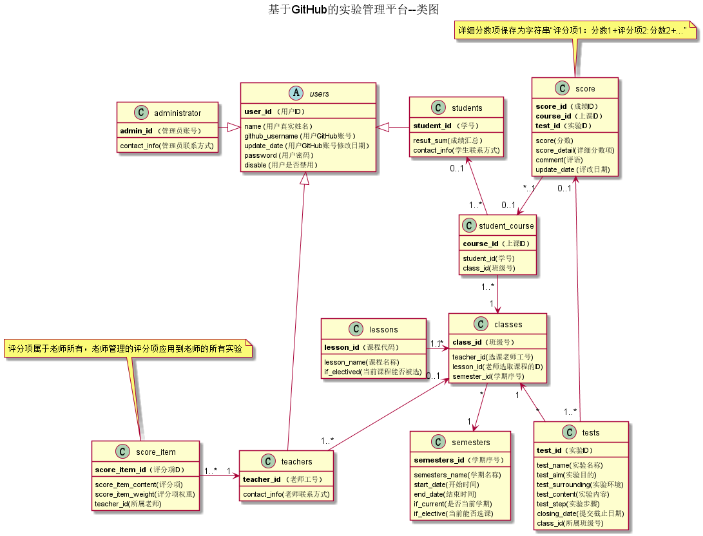

<!-- markdownlint-disable MD033-->
<!-- 禁止MD033类型的警告 https://www.npmjs.com/package/markdownlint -->

# 基于GitHub的实验管理平台的分析与设计

### 成都大学信息科学与工程学院软件工程系-孙守利

|学号|班级|姓名|照片|
|:-------:|:-------------: | :----------:|:---:|
|201510414314|软件(本)15-3|孙守利||

## 1. 概述
- 基于GitHub的实验管理平台的作用是在线管理实验成绩的Web应用系统。学生和老师的实验内容均存放在GitHUB
页面上。
- 学生的功能主要有：一是设置自己的GitHub用户名，二是查询自己的实验和实验成绩。学生的GitHub用户名是公开的，但成绩不公开。
- 老师的功能主要有：一是批改和查看每个学生的成绩，二是管理实验和评分项。
- 管理员的功能主要有：管理用户，批量导入帐户。管理课程，批量导入课程。管理学期，设置当前学期和开关选课。
- 老师和学生都能通过本系统的链接方便地跳转到学生的每个GitHUB实验目录，以便批改实验或者查看实验情况。

界面设计参见：https://shoulisun.github.io/is_analysis/test6/test_manager_ui/登录页面.html

## 3. 用例图设计 [源码](src/UseCase.puml)

## 4. 类图设计 [源码](src/class.puml)

## 5. 数据库设计
- ### [参见数据库设计](src/数据库设计.md)

## 6. 用例及界面详细设计

- ### [“登录”用例](src/UseCaseSpecification/users/登录.md),[界面](https://shoulisun.github.io/is_analysis/test6/test_manager_ui/登录页面.html)
- ### [“修改密码”用例](src/UseCaseSpecification/users/修改密码.md),[界面](https://shoulisun.github.io/is_analysis/test6/test_manager_ui/教师页面.html)
- ### [“修改用户信息”用例](src/UseCaseSpecification/users/修改用户信息.md),[界面](https://shoulisun.github.io/is_analysis/test6/test_manager_ui/教师页面.html)
- ### [“学生列表”用例](src/UseCaseSpecification/users/学生列表.md),[界面](https://shoulisun.github.io/is_analysis/test6/test_manager_ui/教师页面.html)
- ### [“查看用户信息”用例](src/UseCaseSpecification/users/查看用户信息.md),[界面](https://shoulisun.github.io/is_analysis/test6/test_manager_ui/学生页面.html)
- ### [“课程管理”用例](src/UseCaseSpecification/users/课程管理.md),[界面1](https://shoulisun.github.io/is_analysis/test6/test_manager_ui/教师页面.html)，[界面2](https://shoulisun.github.io/is_analysis/test6/test_manager_ui/管理员页面.html)
- ### [“登出”用例](src/UseCaseSpecification/users/登出.md),[界面](https://shoulisun.github.io/is_analysis/test6/test_manager_ui/登录页面.html)

- ### [“查看实验”用例](src/UseCaseSpecification/students/查看实验.md),[界面](https://shoulisun.github.io/is_analysis/test6/test_manager_ui/学生页面.html)
- ### [“查看成绩”用例](src/UseCaseSpecification/students/查看成绩.md),[界面](https://shoulisun.github.io/is_analysis/test6/test_manager_ui/学生页面.html)

- ### [“实验管理”用例](src/UseCaseSpecification/teachers/实验管理.md),[界面](https://shoulisun.github.io/is_analysis/test6/test_manager_ui/教师页面.html)
- ### [“评分项管理”用例](src/UseCaseSpecification/teachers/评分项管理.md),[界面](https://shoulisun.github.io/is_analysis/test6/test_manager_ui/教师页面.html)
- ### [“评定成绩”用例](src/UseCaseSpecification/teachers/评定成绩.md),[界面](https://shoulisun.github.io/is_analysis/test6/test_manager_ui/教师页面.html)

- ### [“学期管理”用例](src/UseCaseSpecification/administrator/学期管理.md),[界面](https://shoulisun.github.io/is_analysis/test6/test_manager_ui/管理员页面.html)
- ### [“用户管理”用例](src/UseCaseSpecification/administrator/用户管理.md),[界面](https://shoulisun.github.io/is_analysis/test6/test_manager_ui/管理员页面.html)

    