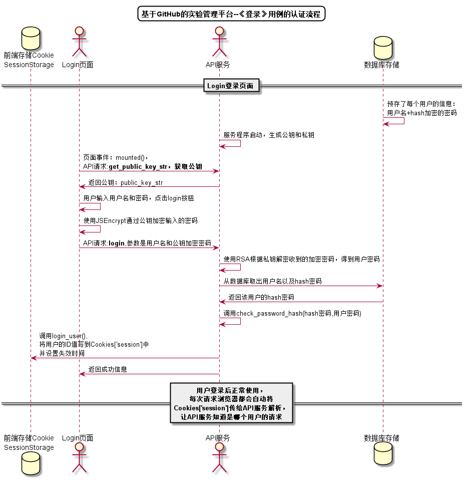

<!-- markdownlint-disable MD033-->
<!-- 禁止MD033类型的警告 https://www.npmjs.com/package/markdownlint -->

# “登录”用例 [返回](../../../README.md)

## 1. 用例规约

|用例名称|登录|
|-------|:-------------|
|功能|登录平台|
|参与者|访客|
|前置条件| |
|后置条件|登录成功后，跳转到主页|
|主流事件| |
|备注| |

## 2. 业务流程
无

## 3. 界面设计
- 界面参照: https://shoulisun.github.io/is_analysis/test6/test_manager_ui/登录页面.html
- API接口调用
    - 接口1：[login](../../api/login.md)

## 4. 算法描述 [源码](../../sequences/users/登录.puml)

    
## 5. 参照表

- [USERS](../../数据库设计.md/#USERS)
